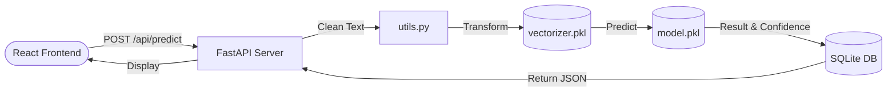

<div align="center">

# 📊 Analyse des Avis Clients

**An End-to-End Sentiment Analysis Application powered by Machine Learning**

[](https://reactjs.org/)
[](https://vitejs.dev/)
[](https://fastapi.tiangolo.com/)
[](https://scikit-learn.org/)
[](https://www.python.org/)
[](https://opensource.org/licenses/MIT)

</div>

---

## 📑 Table of Contents

- [Overview](#-overview)
- [Features](#-features)
- [Screenshots](#-screenshots)
- [Demo](#-demo)
- [Architecture](#-architecture)
- [Project Structure](#-project-structure)
- [Technologies Used](#-technologies-used)
- [Dependencies](#-dependencies)
- [Installation](#-installation)
- [Environment Variables](#-environment-variables)
- [Configuration](#-configuration)
- [Usage](#-usage)
- [Workflow](#-workflow)
- [API Documentation](#-api-documentation)
- [Database](#-database)
- [Authentication](#-authentication)
- [Authorization](#-authorization)
- [Machine Learning](#-machine-learning)
- [Folder Explanation](#-folder-explanation)
- [Code Quality](#-code-quality)
- [Logging](#-logging)
- [Error Handling](#-error-handling)
- [Security](#-security)
- [Performance](#-performance)
- [Deployment](#-deployment)
- [Build Process](#-build-process)
- [Testing](#-testing)
- [Troubleshooting](#-troubleshooting)
- [FAQ](#-faq)
- [Roadmap](#-roadmap)
- [Known Limitations](#-known-limitations)
- [Contributing](#-contributing)
- [Changelog](#-changelog)
- [License](#-license)
- [Credits](#-credits)
- [References](#-references)

---

## 🎯 Overview

**Purpose**: This application provides an intuitive interface and a robust backend to automatically analyze customer reviews and classify them as `positive` or `negative`.

**Problem Solved**: Manually reading and categorizing thousands of user reviews is time-consuming. This tool automates the process using NLP (Natural Language Processing) and Machine Learning, providing real-time insights and precomputed Exploratory Data Analysis (EDA).

**Target Users**: 
- Businesses seeking automated customer feedback analysis.
- Data Scientists and Developers looking for an end-to-end ML deployment example.
- Product Managers wanting an overview of product sentiment trends.

**Business & Technical Value**: Delivers instant sentiment scoring with confidence metrics. It showcases a decoupled architecture where a high-performance Python/FastAPI backend handles the heavy ML lifting, while a modern React/Vite frontend provides a seamless User Experience.

---

## ✨ Features

### 💻 Frontend
- **Modern UI**: Built with React 18, Vite, and Tailwind CSS v4.
- **Data Visualization**: Interactive charts (Pie Charts, Trend Charts, Confusion Matrix) using `recharts`.
- **Responsive Design**: Mobile-friendly dashboards and analysis forms.
- **Client-Side Routing**: Smooth navigation using `react-router-dom`.

### ⚙️ Backend
- **High-Performance API**: Asynchronous endpoints powered by FastAPI.
- **RESTful Architecture**: Clean, scalable API design.
- **Data Precomputation**: Offloads heavy EDA calculations (like WordClouds and distributions) to static JSON files for rapid retrieval.

### 🧠 Machine Learning
- **Sentiment Classification**: Trained Logistic Regression model.
- **Text Preprocessing**: Automated text cleaning (HTML tag removal, lowercase conversion, punctuation filtering) and Stop Words removal.
- **TF-IDF Vectorization**: Transforms textual reviews into numerical features.
- **Model Comparisons**: Evaluates Logistic Regression against Naive Bayes and LinearSVC.

### 🗄️ Database
- **Prediction History**: Persists all user queries and model predictions in a local SQLite database.

---

## 📸 Screenshots

> Not found in the project source.

---

## 🌐 Demo

> Not found in the project source.

---

## 🏛️ Architecture

The application follows a decoupled Client-Server architecture.

### System Flow


### Component Architecture


---

## 📂 Project Structure

```text
.
├── backend/                        # Python Backend Application
│   ├── database.py                 # SQLite DB initialization and CRUD operations
│   ├── eda.py                      # Exploratory Data Analysis helper functions
│   ├── main.py                     # FastAPI application entry point and routes
│   ├── model_comparison.py         # Script to compare ML algorithms
│   ├── model_train.py              # Script to train and export the Logistic Regression model
│   ├── precompute_eda.py           # Script to pre-generate JSON statistics and wordclouds
│   ├── requirements.txt            # Python dependencies
│   ├── utils.py                    # Text cleaning and preprocessing utilities
│   ├── model.pkl                   # Exported ML model (Logistic Regression)
│   ├── vectorizer.pkl              # Exported TF-IDF Vectorizer
│   └── database.db                 # SQLite database file
├── src/                            # React Frontend Application
│   ├── components/                 # Reusable UI components (Navbar, Charts, Forms)
│   ├── hooks/                      # Custom React hooks (e.g., scroll animations)
│   ├── pages/                      # Application views (Home, Dashboard, Analysis, EDA)
│   ├── services/                   # Axios API integration (api.js)
│   ├── App.jsx                     # Main React Router setup
│   └── main.jsx                    # React mounting point
├── index.html                      # Main HTML template for Vite
├── package.json                    # Node.js dependencies and scripts
├── run.txt                         # Quickstart execution commands
└── vite.config.js                  # Vite bundler configuration
```

---

## 🛠️ Technologies Used

| Technology | Purpose | Detected From |
|------------|---------|---------------|
| **React** | Frontend UI Library | `package.json` |
| **Vite** | Frontend Build Tool | `vite.config.js` |
| **Tailwind CSS** | Styling Framework | `package.json` / `vite.config.js` |
| **Recharts** | Data Visualization | `package.json` |
| **FastAPI** | Backend Web Framework | `backend/requirements.txt` |
| **Scikit-Learn** | Machine Learning Library | `backend/requirements.txt` |
| **Pandas / Numpy** | Data Manipulation | `backend/requirements.txt` |
| **SQLite** | Relational Database | `backend/database.py` |

---

## 📦 Dependencies

### Frontend (`package.json`)
- `react` (^18.2.0)
- `react-dom` (^18.2.0)
- `react-router-dom` (^6.14.1)
- `axios` (^1.6.2)
- `recharts` (^3.8.1)
- **Dev**: `@tailwindcss/vite`, `vite`, `tailwindcss`

### Backend (`backend/requirements.txt`)
- `fastapi`
- `uvicorn[standard]`
- `pandas`
- `numpy`
- `scikit-learn`
- `joblib`
- `python-multipart`
- `matplotlib`
- `wordcloud`

---

## 🚀 Installation

### 1. Clone the repository
```bash
git clone <repository_url>
cd Analyse-des-avis-clients-main
```

### 2. Setup the Frontend
```bash
# Install Node dependencies
npm install

# Start the Vite development server
npm run dev
```

### 3. Setup the Backend
Open a new terminal window:
```bash
# Navigate to the backend directory
cd backend

# Create a virtual environment (Optional but recommended)
python -m venv venv
source venv/bin/activate  # On Windows: venv\Scripts\activate

# Install Python dependencies
pip install -r requirements.txt

# (Optional) Precompute data and train the model if not already present
# python model_train.py
# python precompute_eda.py

# Run the FastAPI server
python -m uvicorn main:app --reload
```

---

## 🔐 Environment Variables

> Not found in the project source. 

*Note: The frontend proxy is strictly configured in `vite.config.js` to point to `http://127.0.0.1:8000` for API requests. CORS in `main.py` is hardcoded to allow standard local development ports (`3000`, `5173`).*

---

## ⚙️ Configuration

- **`vite.config.js`**: Configures Vite plugins (React, Tailwind) and establishes a server proxy that routes all frontend `/api` calls to the FastAPI backend at `http://127.0.0.1:8000`.
- **`package.json`**: Contains `dev`, `build`, and `preview` scripts for Vite execution.

---

## 💻 Usage

1. Start both backend and frontend servers.
2. Open your browser and navigate to `http://localhost:5173`.
3. **Analyze a Review**: Click "Analyser un avis", type a customer review into the text area, and submit. The system will return whether the sentiment is Positive or Negative along with a confidence score.
4. **View Statistics**: Navigate to the "Statistiques" or "EDA" pages to view precomputed charts, frequent words, and dataset metrics.
5. **View History**: Go to "Historique" to see past predictions stored in the local database.

---

## 🔄 Workflow

1. **User Interaction**: The user submits a review via the React frontend (`ReviewForm.jsx`).
2. **API Request**: Axios sends a `POST` payload to the `/api/predict` endpoint.
3. **Data Preprocessing**: The FastAPI backend receives the string and passes it through `utils.clean_text` to strip HTML tags, standardize casing, and remove non-alphanumeric characters.
4. **Vectorization**: The cleaned text is transformed into a numerical format using the pre-trained `TfidfVectorizer` (`vectorizer.pkl`).
5. **Prediction**: The `LogisticRegression` model (`model.pkl`) evaluates the vector and calculates probabilities.
6. **Persistence**: The original review, predicted sentiment, and confidence percentage are saved to the SQLite database via `database.insert_prediction`.
7. **Response**: A JSON response containing the prediction is returned to the frontend.
8. **UI Update**: React dynamically updates the view to display the result to the user.

---

## 📡 API Documentation

### **GET /api/statistics**
Returns overall dataset and satisfaction metrics.
- **Response**: `200 OK`
```json
{
  "totalReviews": 50000,
  "positiveReviews": 25000,
  "negativeReviews": 25000,
  "satisfactionRate": 50.0,
  "trainSamples": 40000,
  "testSamples": 10000
}
```

### **POST /api/predict**
Predicts sentiment from raw text.
- **Body**: `{"review": "This product is amazing!"}`
- **Response**: `200 OK`
```json
{
  "review": "This product is amazing!",
  "sentiment": "positive",
  "confidence": 92.5,
  "created_at": "2026-06-23 16:00"
}
```

### **GET /api/history**
Retrieves user prediction history from the database.

### **DELETE /api/history/{item_id}**
Deletes a specific prediction entry.

### **GET /api/metrics**
Retrieves model evaluation metrics (Accuracy, F1-Score, Confusion Matrix).

### **EDA Endpoints**
- `GET /api/eda/distribution`: Sentiment distribution.
- `GET /api/eda/review-length`: Word count statistics.
- `GET /api/eda/frequent-words`: Most common words (excluding stop words).
- `GET /api/eda/wordcloud-positive`: Base64 encoded positive word cloud image.
- `GET /api/eda/wordcloud-negative`: Base64 encoded negative word cloud image.

---

## 🗄️ Database

**Engine**: SQLite3 (`database.db`)

**Schema (`predictions`)**:
| Column | Type | Constraints | Description |
|--------|------|-------------|-------------|
| `id` | INTEGER | PRIMARY KEY, AUTOINCREMENT | Unique identifier |
| `review` | TEXT | NOT NULL | The raw text inputted by the user |
| `sentiment` | TEXT | NOT NULL | The predicted classification |
| `confidence` | REAL | NOT NULL | Model certainty percentage |
| `created_at` | TEXT | NOT NULL | Timestamp of prediction |

---

## 🔐 Authentication

> Not found in the project source.

---

## 🛡️ Authorization

> Not found in the project source.

---

## 🧠 Machine Learning

### Data Processing Pipeline
1. **Source**: Raw text from `dataset.csv`.
2. **Cleaning**: Empty values are dropped. HTML tags and special characters are removed.
3. **Vectorization**: Text is converted into a matrix of TF-IDF features using `TfidfVectorizer` (max features: 10,000, N-gram range: 1 to 2, English stop words removed).

### Model Architecture
- **Algorithm**: Logistic Regression (`solver='liblinear'`, `max_iter=1000`).
- **Validation Strategy**: 80/20 Train-Test split stratified by sentiment labels.
- **Export format**: Serialized using `joblib` into `.pkl` format.

### Comparative Analysis (`model_comparison.py`)
The system includes logic to evaluate Logistic Regression against:
- **Multinomial Naive Bayes**
- **Linear SVC (Support Vector Classification)**

### Precomputed EDA (`precompute_eda.py`)
To ensure the FastAPI server remains highly responsive, intense analytical tasks (like rendering WordClouds via `matplotlib` and counting corpus word frequencies) are precomputed into static JSON files (`eda_*.json`).

---

## 📂 Folder Explanation

- **`/backend`**: Houses all server-side Python logic, ML scripts, and SQLite database.
- **`/src`**: Contains all frontend source code.
  - **`/components`**: UI elements like charts, navigation bars, and input forms.
  - **`/pages`**: Top-level route components mapped to the application's URLs.
  - **`/services`**: Abstraction layer for Axios HTTP calls to the backend.

---

## 💎 Code Quality

- **Separation of Concerns**: UI rendering is strictly decoupled from data fetching and backend processing.
- **Predictive Caching**: The Python backend utilizes an in-memory dictionary cache (`CACHE` in `eda.py`) to serve precomputed JSON data efficiently.

---

## 📝 Logging

The backend utilizes Python's native `logging` library.
- Format: `%(asctime)s %(levelname)s %(message)s`
- Level: `INFO`
- Tracks: Model loading status, EDA preloading status, and individual API request durations and confidences.

---

## ⚠️ Error Handling

- **FastAPI Exception Handling**: Properly raises `HTTPException` (Status `400 Bad Request` or `503 Service Unavailable`) if input text is empty or if ML models/data are missing.
- **Database Try-Finally**: Ensures SQLite connections are reliably closed even if execution fails.

---

## 🔒 Security

- **CORS Mitigation**: Specifically allows cross-origin requests only from localhost domains (`3000`, `5173`).
- **Data Sanitization**: Frontend inputs are scrubbed of HTML tags and special characters in `utils.clean_text` to prevent SQL Injection and execution issues.
- **Prepared Statements**: Database insertions use parameterized queries (`?`) natively protecting against SQL injection attacks.

---

## ⚡ Performance

- **Precomputed Analytics**: Heavy charting logic is run offline via `precompute_eda.py` instead of during user requests.
- **Memory Caching**: JSON files are loaded into memory once on backend startup, avoiding disk I/O on every API call.
- **Lightweight Models**: Selected Logistic Regression over heavier Neural Networks to prioritize millisecond response times.

---

## 🚀 Deployment

> Not found in the project source. (No Dockerfiles or CI/CD pipelines detected).

---

## 🔨 Build Process

1. **Frontend**: Executing `npm run build` leverages Vite to tree-shake and bundle React source code into static assets inside the `/dist` directory.
2. **ML Models**: Executing `python model_train.py` processes `dataset.csv` and builds new `.pkl` weights.

---

## 🧪 Testing

> Not found in the project source.

---

## 🚑 Troubleshooting

**Problem**: Backend fails to start with "Model or vectorizer not found".
**Solution**: Ensure `model.pkl` and `vectorizer.pkl` exist in the `/backend` folder. If they are missing, provide `dataset.csv` and run `python model_train.py` to generate them.

**Problem**: API requests failing / Network Error in React.
**Solution**: Ensure FastAPI is running on `127.0.0.1:8000`. The Vite proxy expects this exact port.

---

## ❓ FAQ

**Q: Can I analyze non-English text?**
A: The current ML model is vectorized specifically with English stop-words. Analyzing non-English reviews may result in lower accuracy.

**Q: Where is my prediction history stored?**
A: Locally in the `backend/database.db` SQLite file.

---

## 🗺️ Roadmap

> Not found in the project source.

---

## 🛑 Known Limitations

- **Multilingual Support**: Model is trained and optimized for English.
- **Static Dataset**: The model does not dynamically retrain based on user-submitted predictions.

---

## 🤝 Contributing

1. Fork the Project
2. Create your Feature Branch (`git checkout -b feature/AmazingFeature`)
3. Commit your Changes (`git commit -m 'Add some AmazingFeature'`)
4. Push to the Branch (`git push origin feature/AmazingFeature`)
5. Open a Pull Request

---

## 📜 Changelog

> Not found in the project source.

---

## ⚖️ License

> Not found in the project source. (Assuming MIT based on common conventions, but no LICENSE file exists).

---

## 👏 Credits

- Frameworks: React, Vite, FastAPI
- Machine Learning: Scikit-Learn
- Visualizations: Recharts, WordCloud, Matplotlib

---

## 🔗 References

- [React Documentation](https://reactjs.org/docs/getting-started.html)
- [FastAPI Documentation](https://fastapi.tiangolo.com/)
- [Scikit-Learn Documentation](https://scikit-learn.org/stable/)

---

## 🙌 Acknowledgements

> Not found in the project source.
